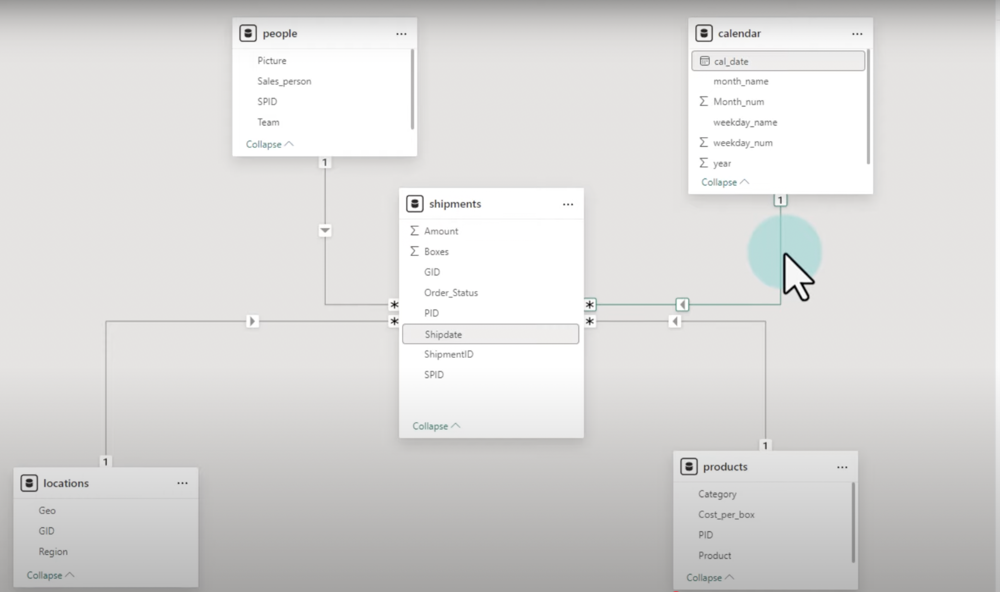
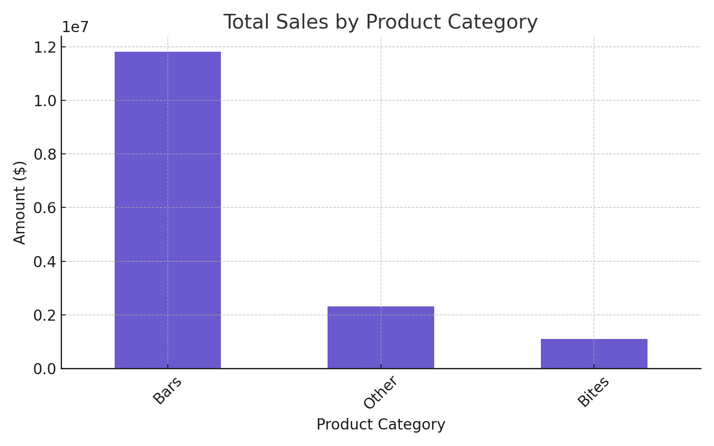
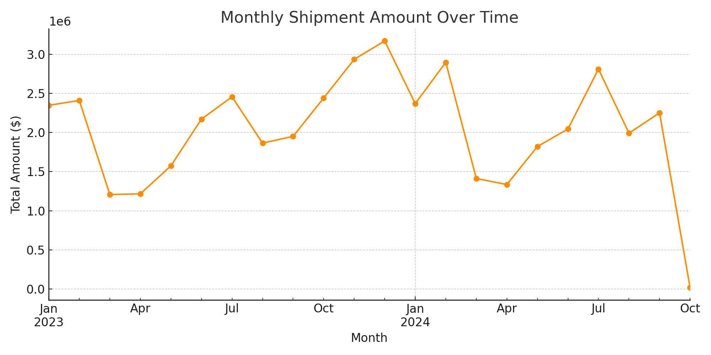

# 🍫 Chocolate Sales Performance Dashboard

An interactive **Power BI dashboard** for analyzing chocolate product shipments, sales volume, and category trends across a fictional retail network. Built using **Power BI, Excel, DAX**, and dynamic modeling techniques, this dashboard helps uncover key sales insights and business metrics like revenue, shipment size, and category performance.

---

## 🔍 Project Highlights

- Analyze total sales amount, shipment count, and boxes per shipment.
- Compare team member performance using DAX-based KPIs.
- Visualize sales by category and monthly shipment trends.
- Identify top-performing products and categories.
- Evaluate performance against a custom target.

---

## 🧠 Data Model Design (Power BI)

The data model follows a **star schema** centered on the `shipments` fact table. It links to four key dimension tables:

- `people`: Contains sales rep details.
- `calendar`: Supports date-based filtering and time intelligence.
- `products`: Provides product and category metadata.
- `locations`: Maps shipments to geographical regions.

This structure supports optimized DAX performance and clear relationship paths.

---

## 📊 Sample Visuals

### Total Sales by Product Category

### Monthly Shipment Trend

---

## 📁 Project Structure
